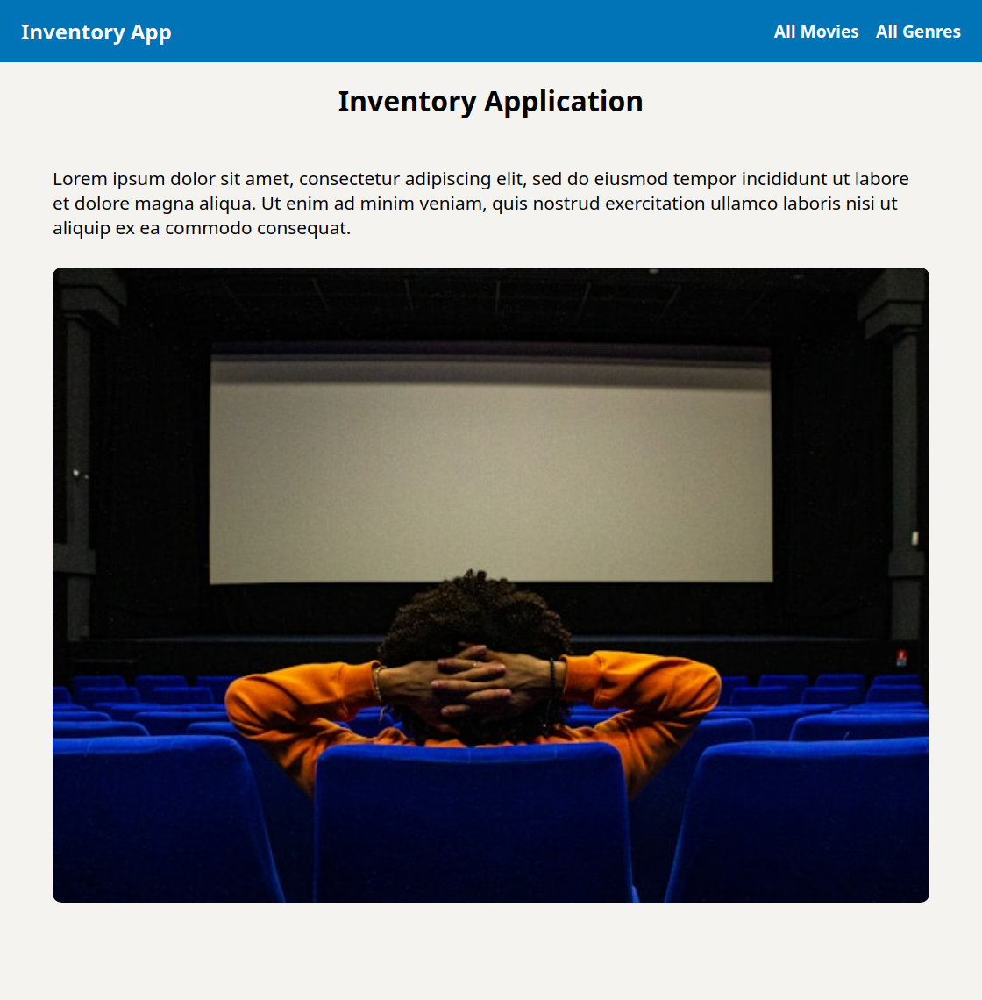

# Odin Project #24: Inventory Application

The goal of this Odin Project assignment was to create a full stack inventory management app for an imaginary store (in this case a movie store) using Express, EJS and PostreSQL. The database has two tables: genres and movies. The user can perform CRUD operations in the databse by browsing, adding, editing and deleting items. Deleting a genre will also delete all of the movies belonging to this genre. Authentication wasn't the focus of this assignment, but before deleting an item the user has to enter a password matching the one stored in .env. 

I started and finished this project in August 2024.

## Assignment

[The Odin Project - NodeJS - #24 Inventory Application](https://www.theodinproject.com/lessons/node-path-nodejs-inventory-application)

## Technology

- JavaScript
- Node.js
- Express
- Express validator
- PostreSQL
- EJS
- CSS

## Key Concepts

- MVC: Model View Controller pattern
- Express: setting up an app, middleware functions
- Routes: Express Router, HTTP verbs, paths
- Controllers: response methods, middleware, CRUD operations in the database
- Views: EJS configuration, using JS inside templates, sharing components across templates, rendering a view in a controller callback, serving static assets
- PostreSQL: instalation, setting up a db, using node-postgres in Express (client & pool), database queries
- Express validator: form data validation: body() function & validationResult
- Error handling: error middleware function, custom errors; express-async-handler: catching thrown errors 
- dotenv: env variables

## Screenshots

### Desktop




### Mobile


## Sources

- https://unsplash.com/photos/VuN3x0cKC4I by Marius GIRE
- https://www.themoviedb.org/ - movie poster links

## Deployment

Requires setting up a PostreSQL database and adding its URL to the .env file. Instructions for Linux and macOS can be found [here on The Odin Project website](https://www.theodinproject.com/lessons/nodejs-installing-postgresql).

```bash
# clone repo
git clone https://github.com/BrightNeon7631/odin-inventory-application.git

# add default data to the db
npm run seed

# start server
node app.js
```